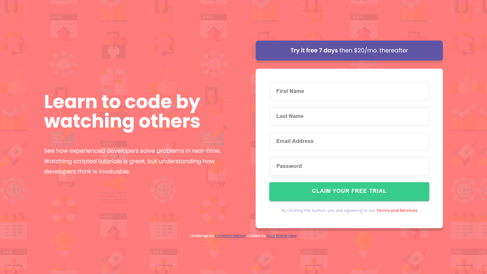

# Frontend Mentor - Intro component with sign up form solution

This is a solution to the [Intro component with sign up form challenge on Frontend Mentor](https://www.frontendmentor.io/challenges/intro-component-with-signup-form-5cf91bd49edda32581d28fd1). Frontend Mentor challenges help you improve your coding skills by building realistic projects. 

## Table of contents

- [Overview](#overview)
  - [The challenge](#the-challenge)
  - [Screenshots](#screenshots)
  - [Links](#links)
- [My process](#my-process)
  - [Built with](#built-with)
  - [What I learned](#what-i-learned)
  - [Useful resources](#useful-resources)
  - [AI Collaboration](#ai-collaboration)
- [Author](#author)

## Overview

### The challenge

Users should be able to:

- View the optimal layout for the site depending on their device's screen size
- See hover states for all interactive elements on the page
- Receive an error message when the `form` is submitted if:
  - Any `input` field is empty. The message for this error should say *"[Field Name] cannot be empty"*
  - The email address is not formatted correctly (i.e. a correct email address should have this structure: `name@host.tld`). The message for this error should say *"Looks like this is not an email"*

### Screenshots

#### Base Designs
* **Desktop View:**
  

* **Mobile View:**
  

#### Interactive & Active States
* **Button Hover/Active State:**
  

* **Form Validation - Empty Fields State:**
  

* **Form Validation - Incorrect Email Format State:**
  

### Links

- Solution URL: [Frontend Mentor Solution](https://your-solution-url.com)
- Live Site URL: [Github Pages Live Preview](https://jusnow1608.github.io/intro-component-with-signup-form-master-javascript/)

## My process

### Built with

- Semantic HTML5 markup
- CSS custom properties (Variables)
- Flexbox
- Mobile-first workflow
- Vanilla JavaScript (Custom multi-conditional form validation)
- Modern CSS Logical Properties (`padding-inline-end`)
- Fluid Responsive Design (`clamp()`)

### What I learned

This project was a fantastic deep dive into practical debugging, form validation behaviors, and advanced layout structures. Below are the key issues I discovered during the process and how I successfully resolved them:

#### 1. Fluid Typography & Element Squeezing
* **The Bug:** At intermediate tablet/desktop screen sizes (before hitting the primary media query breakpoint), the entire form element became heavily compressed and squeezed. This caused text within labels to clip and input forms to look disproportionately narrow.
* **The Solution:** I refactored static padding rules and replaced them with the dynamic CSS `clamp()` function. This allowed container inline spacing to smoothly expand and contract relative to the user's viewport width.

```css
body {
  padding-inline: clamp(1rem, 8vw, 10rem);
}
```

#### 2. HTML5 Validation vs. Custom Script Conflicts
The Bug: Setting the HTML field type to type="email" allowed the browser's built-in validation rules to step in before my custom JavaScript ran. When users entered an invalid email syntax, the field returned a broken state, preventing the script from rendering the dynamic message change. The warning text remained stuck on "Email Address cannot be empty" instead of shifting to the proper contextual alert.

The Solution: I redirected validation authority completely to standard JavaScript by checking value configurations inside sequential if / else if structures and implementing RegExp matching:

```js
if (emailValue === '') {
    setErrorFor(email, "Email Address cannot be empty");
} else if (!isEmail(emailValue)){
    setErrorFor(email, "Looks like this is not an email");
} else {
    setSuccessFor(email);
}
```

#### 3. Error Icon Misalignment inside Dynamic Wrappers
The Bug: Initially, generating the red exclamation points using an ::after pseudo-element on the .form-control block caused structural scaling issues. When validation errors occurred, the addition of the <small> message tag expanded the wrapper's vertical area. The absolute top: 50% calculation computed the height including the message text, which pulled the icon out of the input block and dragged it downward.

The Solution: I completely abandoned absolute pseudo-element positioning on the text wrappers. Instead, I declared the error icon directly as a background element bound onto the input field itself, ensuring it calculates alignment exclusively relative to the input box borders. I combined this with CSS logical properties for structural localization:

```css
.form-control.error input {
  border: 0.125rem solid var(--red400);
  background-image: url('images/icon-error.svg');
  background-repeat: no-repeat;
  background-position: right 1rem center;
  padding-inline-end: 3rem;
}
```

## Useful resources
MDN Web Docs - CSS Logical Properties - This helped me master progressive styling concepts such as padding-inline-end to handle modern responsive structures and bidirectional design interfaces effortlessly.

## AI Collaboration
For this project, I collaborated with an AI assistant to streamline my debugging workflow and refine my CSS architecture. This partnership helped me:

Refactor Layout Quirks: Brainstorm solutions for positioning error indicators when static elements disrupted form flow.

Modernize CSS Syntax: Migrate traditional alignment rules over to modern CSS Logical Properties (e.g., swapping padding-right for padding-inline-end) to adhere to global accessibility benchmarks.

Optimize Validation Flow: Isolate and eliminate subtle layout layout-clipping and browser engine validation conflicts quickly.

## Author
- GitHub - [@Jusnow1608](https://github.com/Jusnow1608)
- Frontend Mentor - [@Jusnow1608](https://www.frontendmentor.io/profile/Jusnow1608)
- LinkedIn - [@Justyna-Nowak-Szrajnert](https://www.linkedin.com/in/justyna-nowak-szrajnert-a5168713b/)